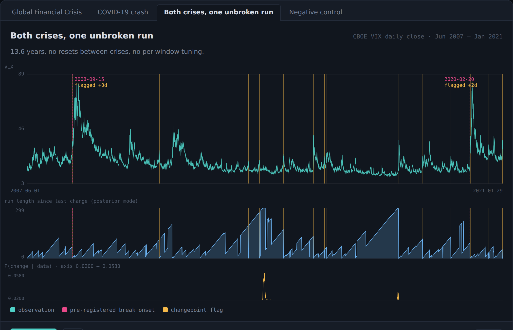

# BRE — a Bayesian decision stack, and the two crises it was tested against

[](https://github.com/csj571/bre-public/actions/workflows/ci.yml)
[](pyproject.toml)
[](LICENSE)

Everyone ships a confidence number. Almost nobody scores it.

This repository holds a from-scratch Bayesian engine — Gaussian-process
regression with BALD acquisition, Bayesian online changepoint detection, an
adaptive Kalman filter, Beta-Binomial truth-tracking, Brier/ECE calibration with
Platt and isotonic recalibration, an online preference learner, a Brier-gated
prior registry, and a policy gate that abstains rather than bluffs — together
with the one thing that makes any of it worth reading: **a validation against
external truth that was registered before the data was scored.**

The test domain is markets, because price resolves truth cheaply. The question
is not "can it predict a crash" — it cannot, and nothing here claims otherwise.
The question is **how fast an uncertainty-aware model notices that the world
changed underneath it.**

## The result

Unmodified Bayesian Online Changepoint Detection (Adams & MacKay 2007), running
at its defaults, over real market data:

| Series | Structural break | Onset (pre-registered) | First flag | Detection latency |
|---|---|---|---|---|
| S&P 500 daily log returns, 2007–2009 | Lehman Brothers | 2008-09-15 | 2008-09-15 | **same day** |
| S&P 500 daily log returns, 2019–2020 | COVID-19 crash | 2020-02-20 | 2020-02-24 | **2 trading days** |
| CBOE VIX daily close, 2007–2021 | both, one unbroken run | — | — | **0 and 2 days** |
| 21-day realized volatility, 2019–2020 — *negative control* | COVID-19 crash | 2020-02-20 | — | **missed** |

Both onsets were fixed in `validation/markets/validate_regimes.py` before any
series was loaded. No hyperparameter was tuned per window; the latencies are
stable across hazard priors λ = 50–250.

**The control matters as much as the hits.** Fed a smoothed, strongly
autocorrelated series, the same detector misses COVID entirely — the documented
failure mode of vanilla Adams-MacKay on autocorrelated financial data. An
implementation that flagged everything you fed it would be the suspicious one.



*13.6 years of VIX in one unbroken run. Top: the series, with the pre-registered
onsets in pink and the detector's flags in amber. Middle: the run-length
posterior — long ramps that collapse when the regime breaks. Bottom:
P(change | data), which over 13.6 years spikes exactly twice.*

## See it

```bash
python3 -m http.server            # from the repo root, then open localhost:8000
```

- **[`/showcase/`](showcase/)** — the two crises replayed day by day, computed in
  your browser from the CSVs in this repo. Watch the run-length posterior ramp
  for months and then collapse in a single session.
- **[`/sim/`](sim/)** — the reference simulator: the full stack on generated
  scenarios, including the epistemic/aleatoric split and the
  ACT / QUERY MORE / DEFER policy gate.

Serve the **repository root** — the showcase reads the CSVs in
`validation/markets/data/`, and ES-module imports need HTTP rather than
`file://`. There is no build step for any of it.

To publish the same pages: **Settings → Pages → Source: "GitHub Actions"**. The
committed `.github/workflows/pages.yml` uploads the tree as-is on every push to
`main`; until Pages is enabled it does nothing.

## Run it

```bash
pip install -e ".[dev]"                            # numpy + scipy + pytest
pytest tests/ -q                                   # 48 tests, ~9s
python validation/markets/validate_regimes.py      # score the vendored VIX slice
node sim/test.mjs                                  # 67 golden-value JS tests
```

Add `".[dev,torch]"` for the preference learner and its 5 tests; without torch
they skip and the other 48 still run.

`validate_regimes.py` prints the scored gate over 13.6 years of real VIX: both
pre-registered breaks detected, at 0 and 2 trading days.

## What is here

```
engine/               9 Bayesian primitives, numpy + scipy (torch for one)
showcase/             the 2008 / COVID replay — zero build, runs in a browser
sim/                  the reference simulator (+ 67 golden-value tests)
validation/markets/   the harness, the real data, and the scored write-ups
tests/                53 tests (48 without the torch extra), incl. the launch gates
tools/                CLI harness for the JS/Python parity check
```

## The engine

Nine primitives. Every module except `preference.py` imports on numpy + scipy
alone, and `changepoint.py` — the one behind the result above — is pure standard
library.

| Module | Method | One line |
|---|---|---|
| `gp.py` | GP regression + BALD | Cholesky posterior with recursive jitter; Matérn/RBF/cosine kernels; `predict()` returns mean **and epistemic std**; BALD = H[y\*] − E[H[y\*\|f]] |
| `changepoint.py` | BOCPD (Adams-MacKay 2007) | exact run-length posterior, Normal-Inverse-Gamma → Student-t predictive |
| `calibration.py` | proper scoring | Brier + Murphy decomposition, ECE/MCE, reliability curves, Platt & isotonic recalibrators, ECE gate |
| `kalman.py` | adaptive 1-D Kalman | observation noise adapts to the EWMA of squared innovations |
| `beta_binomial.py` | conjugate truth-tracking | Beta-Binomial posterior + credible intervals (hand-rolled incomplete beta) |
| `policy_gate.py` | decision rule | ACT / QUERY MORE / DEFER over the epistemic/aleatoric split |
| `registry.py` | Brier-gated prior registry | posterior→prior promotion only when rolling Brier over ≥20 resolved outcomes beats the 0.25 chance baseline |
| `preference.py` | preference learning *(torch)* | Bradley-Terry likelihood + Laplace approximation; sequential posterior→prior folding; returns reward mean **and** std for LCB objectives |
| `seeding.py` | reproducibility | one call seeds python/numpy/torch |

```python
from engine.changepoint import BOCPD, detect_changepoints
from engine.calibration import brier_score, ece, PlattScaler
from engine.gp import GaussianProcessRegressor
from engine.policy_gate import decide
```

Installed as a package it imports under a collision-safe namespace:
`from bre.engine.changepoint import BOCPD`. `preference.py` is the only module
that needs torch, and it is an extra rather than a dependency:

```bash
pip install -e .              # everything above except preference.py
pip install -e ".[torch]"     # adds the preference learner
```

## Reading the result honestly

The headline is a **latency** number, and it is the pre-registered part. Three
things temper it, all of them reported in full in
[`validation/markets/results/`](validation/markets/results/):

- **False alarms are real.** Over 13.6 years the VIX run produces 14 flags
  against a 2-break truth set — a raw false-alarm rate of 0.86. Every extra flag
  does land on a documented, dateable stress event (Fukushima, the 2015 China
  devaluation, Volmageddon, …), which is why the harness also prints a
  documented-adjusted rate of 0.00 — but that secondary event list was compiled
  *after* seeing the output, so it is disclosed as post-hoc and is not the claim.
- **It is chatty in calm markets.** 5–6 flags/year in flat 2004–06 and 2013–14 at
  the default hazard.
- **A shuffled placebo fires more, not less.** Destroying regime structure while
  keeping the fat-tailed marginal produces *more* flags than real data. An
  individual flag is weak evidence; the run-length posterior is the signal.

So the supported claim is **fast detection of calm→turbulent regime transitions
at documented crisis onsets** — not low-false-alarm event detection. On a longer
33-year, 9-break test the detector catches the transitions it can structurally
catch (1997, 2008, 2015, 2018, 2020) and misses the breaks that occur *inside*
an already-turbulent regime, which is what a run-length detector should do.

## What is deliberately not claimed

- **No novel mathematics.** Kriging 1950s, Kalman 1960, Brier 1950, BOCPD 2007,
  BALD 2011 — all established, all cited. The contribution is a faithful,
  inspectable, CPU-scale synthesis with external validation attached.
- **No prediction.** Every flag lands on or after the onset. This is detection.
- **No trading claim.** The measurement is latency, not returns. Nothing here is
  a signal, a strategy, or a backtest.
- **No validated cross-domain transfer.** The same machinery is designed to apply
  to other domains, but "validated on VIX and the S&P" makes it validated *there*.
  Validation transfers only where ground truth is cheap.
- **The external validation covers the changepoint path.** `preference.py`,
  `registry.py` and the rest are tested primitives, not externally validated
  results — the RLHF study that exercises the preference learner lives in the
  research repo and is not reproduced here. Read the table above as "what the
  engine contains", and the result table at the top as "what has been scored".
- **No emotional or physiological state detection.** Permanently out of scope —
  not a backlog item. No cheap ground truth exists for it.
- "Gate passed" never means "the engine is validated" beyond that domain, that
  slice, and those dates.

## Reproducibility

The data is real and externally sourced — the point of the exercise is that the
ground truth is not self-produced. The VIX slice is a published dataset copied as
is; the S&P series are derived from real closes shipped inside the `skfolio`
package, and `fetch_data.py` verifies four of those closes against independently
documented historical values before writing anything.

```bash
pip install -e ".[dev,data]"
python validation/markets/fetch_data.py            # re-derive the S&P series
python validation/markets/validate_regimes.py --data validation/markets/data/sp500_logret_gfc.csv
python validation/markets/validate_regimes.py --data validation/markets/data/sp500_logret_covid.csv
python validation/markets/robustness_checks.py     # every table in robustness_checks.md
```

Three guards keep the numbers from drifting away from the code:

| Test | What it holds |
|---|---|
| `tests/test_regime_detection.py` | the published latencies, and the control's miss |
| `tests/test_js_python_parity.py` | the browser detector and the Python engine flag **identical** indices |
| `tests/test_data_integrity.py` | the committed CSVs byte-match a fresh derivation |

Provenance, and what was left behind when this was extracted from its research
repo: [`PROVENANCE.md`](PROVENANCE.md).

## License

MIT — see [`LICENSE`](LICENSE).
